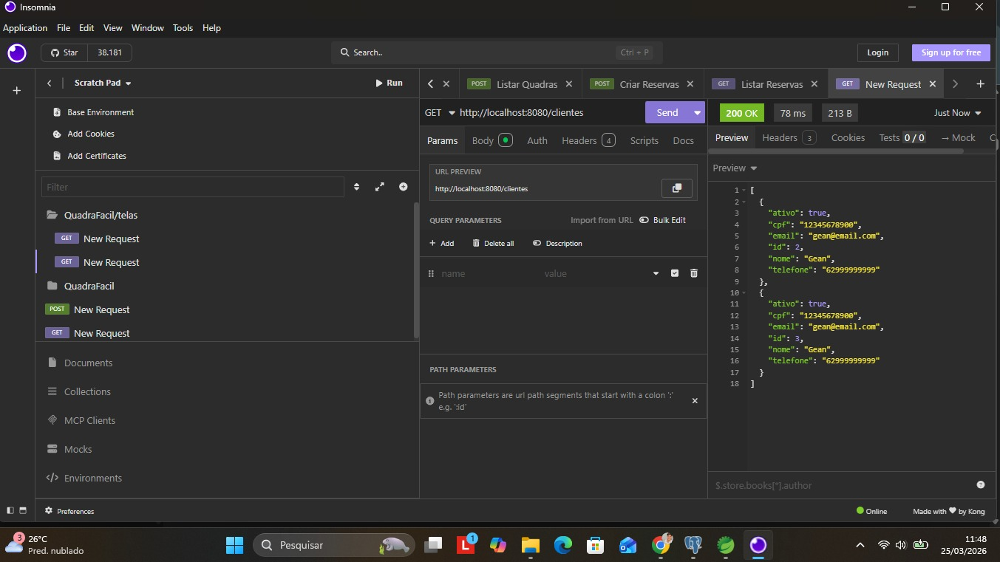
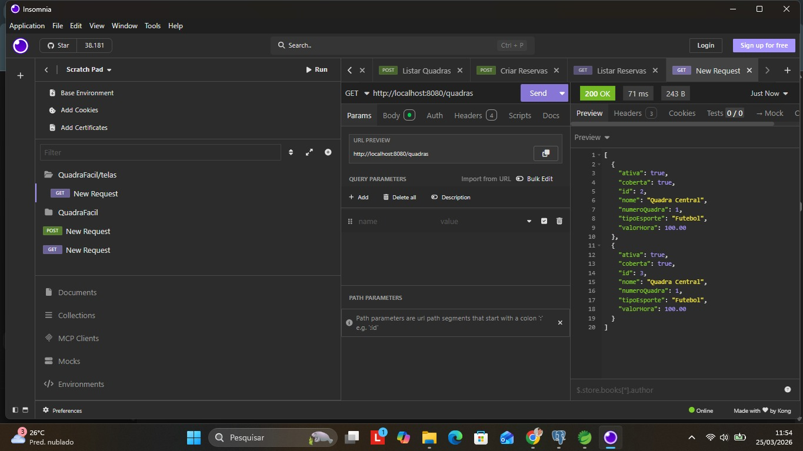
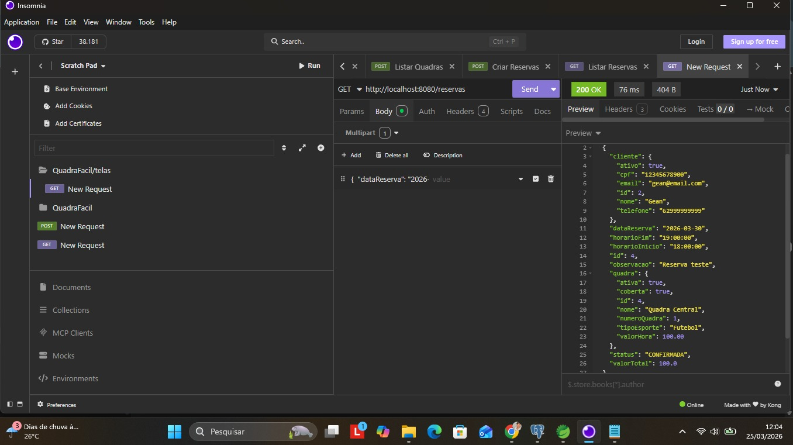

# QuadraFácil - Backend

Sistema de agendamento de quadras esportivas desenvolvido com Spring Boot.
O projeto tem como objetivo gerenciar reservas, clientes e quadras de forma organizada, garantindo controle de horários e evitando conflitos de agendamento.

---

## Sobre o Projeto

O **QuadraFácil** é uma API REST que permite o gerenciamento completo de um sistema de reservas de quadras esportivas.
Foi desenvolvido como projeto acadêmico, aplicando conceitos fundamentais de desenvolvimento backend, arquitetura em camadas, persistência de dados e validações de regras de negócio.

---

## Tecnologias Utilizadas

* Java 21
* Spring Boot
* Spring Data JPA
* PostgreSQL
* Maven
* Insomnia (testes de API)

---

## Arquitetura

O projeto segue o padrão arquitetural em camadas:

* Controller: responsável por receber as requisições HTTP
* Service: responsável pelas regras de negócio
* Repository: responsável pelo acesso aos dados
* Model: representação das entidades do sistema

---

## Funcionalidades

### Cliente

* Cadastro de clientes
* Consulta por ID
* Listagem de clientes
* Atualização de dados
* Exclusão de registros

### Quadra

* Cadastro de quadras
* Listagem de quadras
* Atualização de dados
* Exclusão de registros

### Reserva

* Criação de reservas
* Listagem de reservas
* Consulta por ID
* Atualização de reservas
* Cancelamento de reservas
* Validação de conflito de horários para a mesma quadra

---

## Banco de Dados

O sistema utiliza PostgreSQL e é composto pelas seguintes entidades:

* Cliente
* Quadra
* Reserva

### Relacionamentos

* Cada reserva está associada a um cliente
* Cada reserva está associada a uma quadra

---

## Como Executar o Projeto

### 1. Clonar o repositório

git clone https://github.com/seu-usuario/quadrafacil.git

---

### 2. Configurar o banco de dados

No arquivo `application.properties`:

spring.datasource.url=jdbc:postgresql://localhost:5432/quadrafacil
spring.datasource.username=seu_usuario
spring.datasource.password=sua_senha

---

### 3. Executar o projeto

mvn spring-boot:run

---

## Endpoints Principais

| Método | Endpoint  | Descrição      |
| ------ | --------- | -------------- |
| GET    | /clientes | Lista clientes |
| POST   | /clientes | Cria cliente   |
| GET    | /quadras  | Lista quadras  |
| POST   | /quadras  | Cria quadra    |
| GET    | /reservas | Lista reservas |
| POST   | /reservas | Cria reserva   |

---

## Testes com Insomnia

Exemplos de requisições utilizadas durante os testes:

* Criação de cliente: POST /clientes
* Criação de reserva: POST /reservas

---

## Prints da API

Algumas das requisições realizadas no Insomnia:

Listagem de clientes:

Listagem de Quadras:

Listagem de Reservas:

Com as demais imagens, contidas na pasta docs, separada as demais pastas do projeto

## Regras de Negócio

* Não é permitido criar reservas com conflito de horário para a mesma quadra
* Toda reserva deve estar vinculada a um cliente e a uma quadra
* Validação de existência antes de atualizar ou excluir registros

---

## Autor

Projeto desenvolvido pelo estudante, Geanderson Augusto Toledo Rodrigues
Estudante de Sistemas de Informação

---

## Status do Projeto

Em desenvolvimento
